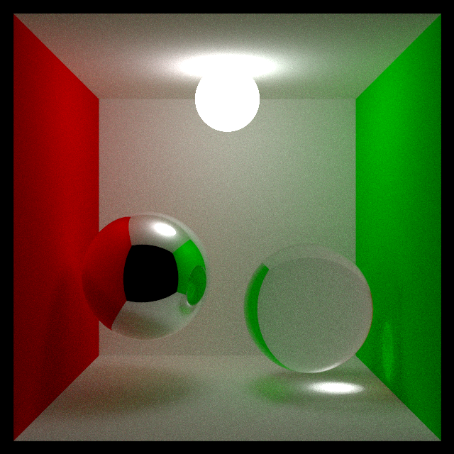

# silver

A 3D rendering library for Rust.

Referenced [Peter Shirley's Ray Tracing in One Weekend](https://raytracing.github.io/books/RayTracingInOneWeekend.html).




## Example usage

```
$ cargo run --release --example cornell_box
```
